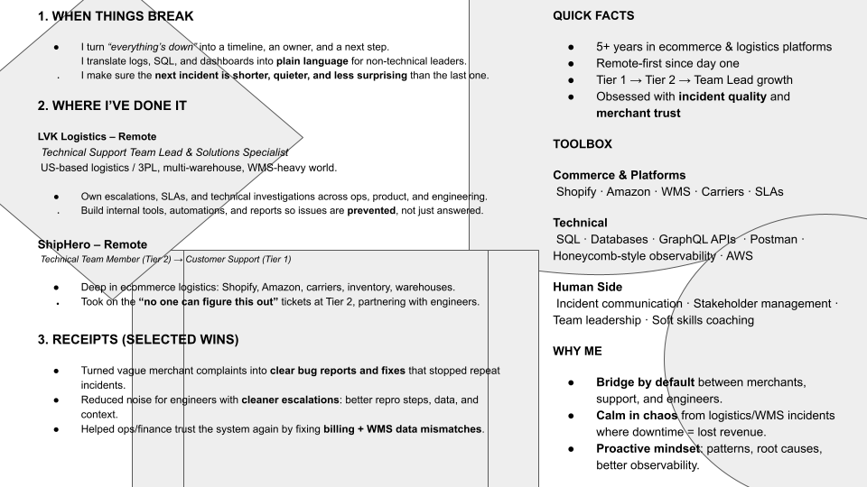

# Luis Perrone

<!-- RAINBOW LINE TOP -->

<!-- GIF HEADER -->

<!--Me DESCRIPCION -->

## About

Solutions Specialist (3PL/Logistics) | Automations, Reporting, and
Full-stack projects (React, Node.js, Python). Now building apps with V0
and Cursor.  
Buenos Aires (UTC-3) · Remote

- 📚 Currently working at
  [Shiphero](https://github.com/Shiphero)

<h3 align="left">Companies</h3>

  
  

- 🌱 Transitioning into software engineering. Resume below (PDF).

    <!-- CV -->
    

<!-- CONTACT -->
<h3 align="left">Connect with me</h3>

<!-- LENGUAGES AND TOOLS -->
<h3 align="left">Languages and Tools</h3>

  
  
  
  
  
  
  
  
  
  
  
  

  

### Portfolio status

**Flag Dictionary Project** (Live demo): <https://luisperronedev.github.io/Flag-Dictionary-Project/>

  
  
  

<!-- STATS Y LENGUAGES USED -->
<table>
  <tr>
    <td align="center">
      
    </td>
    <td align="center">
      
    </td>
  </tr>
</table>

<!-- GIF FOOTER -->

<!-- RAINBOW LINE BOT -->

---

[Luis Perrone](https://github.com/LuisPerroneDev)

Last updated: 2025-12-15
